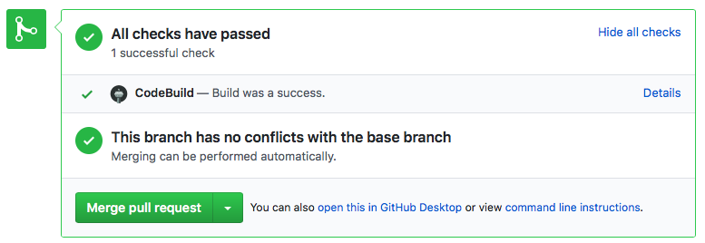
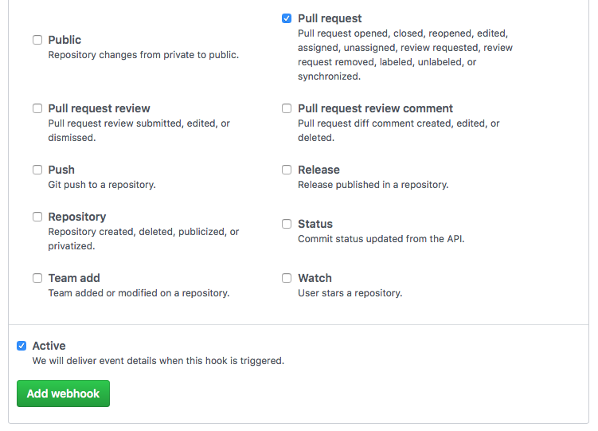

# Using AWS CodeBuild as a CI Service with GitHub

[AWS CodeBuild](https://aws.amazon.com/codebuild/) is a fully manage build service that offers continuous scaling, metered pricing, and flexibility. This repository is an example application to integrate CodeBuild with GitHub. This project will allow you to run tests or builds on every pull request automatically using CodeBuild.

[See our associated blog article](https://link_to_article)

#### Advantages of CodeBuild

- Metered pricing (pay for build time, not subscription)
- Free Tier for testing
- Default 20 concurrent builds limit
- Unlimited build minutes
- Integration into other AWS Services



## Infrastructure

The included CloudFormation template creates:

- IAM Roles for Lambda Function, CodeBuild Project, and API Gateway
- Lambda Function
- API Gateway
- CodeBuild Project
- CloudWatch Event Rule

_All of these service are [Free Tier](https://aws.amazon.com/free/) eligible_

## Setup

**Step 1: Create Deployment Package**

First, we have to create a deployment package for Lambda and upload it to S3. You can create a deployment package by navigating to the root of the repository and running the `create_deployment_package.sh` script.

```
$ ./create_deployment_package.sh
```

This will output a zip file called `codebuild-ci-lambda.zip`. Upload that to any S3 bucket in the same region that you will be creating your infrastructure in.

**Step 2: Get API Token**

We must get an API token to authenticate to GitHub. We will reference this in our CloudFormation template so Lambda function can create Statuses.

To create an API token [See the GitHub documentation.](https://help.github.com/articles/creating-a-personal-access-token-for-the-command-line/)

_Creating a [GitHub App](https://developer.github.com/apps/) or something similar is best practice. We are using a personal token to easily run this sample. Personal tokens are not recommended in production._

**Step 3: Create Infrastructure**

We can now create our infrastructure in AWS. I have provided a CloudFormation template in this repository that creates everything required.

Choose _Deploy to AWS_ to launch the template in your account.

Region | Launch Template
------------ | -------------
**N. Virginia** (us-east-1) | [](https://console.aws.amazon.com/cloudformation/home?region=us-east-1#/stacks/new?stackName=CodeBuild-CI-Sample&templateURL=https://s3.amazonaws.com/codebuild-ci-sample-us-east-1/codebuild-ci.json)
**Ohio** (us-east-2) | [](https://console.aws.amazon.com/cloudformation/home?region=us-east-2#/stacks/new?stackName=CodeBuild-CI-Sample&templateURL=https://s3-us-east-2.amazonaws.com/codebuild-ci-sample-us-east-2/codebuild-ci.json)
**N. California** (us-west-1) | [](https://console.aws.amazon.com/cloudformation/home?region=us-west-1#/stacks/new?stackName=CodeBuild-CI-Sample&templateURL=https://s3-us-west-1.amazonaws.com/codebuild-ci-sample-us-west-1/codebuild-ci.json)
**Oregon** (us-west-2) | [](https://console.aws.amazon.com/cloudformation/home?region=us-west-2#/stacks/new?stackName=CodeBuild-CI-Sample&templateURL=https://s3-us-west-2.amazonaws.com/codebuild-ci-sample-us-west-2/codebuild-ci.json)

The template has the follow Parameters:

- `RepositoryUrl` - HTTPS Clone URL of the repository in GitHub. Example: 'https://github.com/owner/repo.git'
- `GithubToken` - GitHub API Token used for Status creation.
- `ProjectName` - Name to give the CodeBuild Project. For this sample, use the same name as your repository.
- `S3Key` - S3 Key for Lambda Function Zip
- `S3Bucket` - S3 Bucket name for Lambda Function Zip
- `BuildImage` - Docker Image to use in CodeBuild Project

Once you have created your infrastructure via CloudFormation, navigate to the **Outputs** tab in your CloudFormation Stack. There will be an Output called "WebhookUrl". This is your API Gateway endpoint to use in GitHub. Copy this for use in the next step.


**Step 4: Setup GitHub**

Now we can navigate to our repository in GitHub and go to the Settings page. Under the "Webhooks" section, we can click _Add webhook_ in the upper right. Here we can paste in the https url for our API Gateway endpoint that we grabbed from Step 2. Change the _content-type_ to `application/json`.

Under the _Which events would you like to trigger this webhook?_ heading, select the "Let me select individual events." option. Then check the `Pull Request` box and deselect the `Push` box. Make sure the 'Active' box is checked then click "Add webhook".



You should then see a green checkmark by your webhook url.

_To learn more about adding webhooks to a repository, [see the GitHub documentation](https://developer.github.com/webhooks/creating/)_

**Step 5: Open a Pull Request**

That should be all we need! To try it out, simply open a new pull request in your repository. You should see a Status of `pending` appear with a link to CodeBuild. The Status will be updated once the build completes. A build will be triggered whenever a pull request is Opened, Reopened, or Synchronized (pushed to).

**Don't forget to add a [buildspec.yml](http://docs.aws.amazon.com/codebuild/latest/userguide/build-spec-ref.html) file to your repository.** This is required by CodeBuild to know what commands to run.
